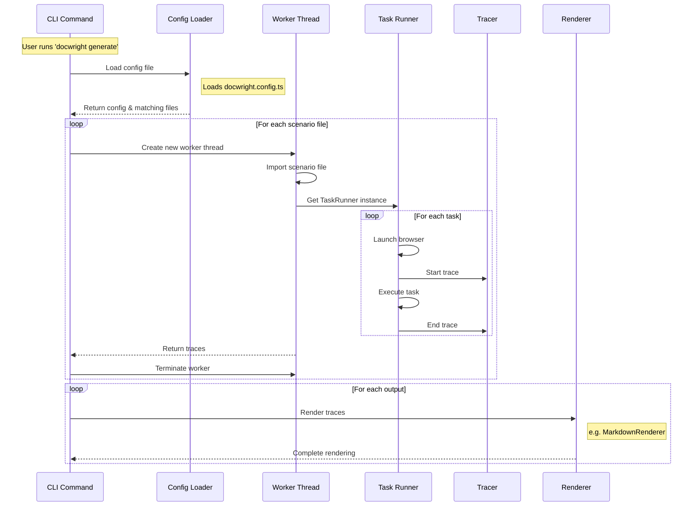

# Technical Details

## Why Bun?

docwright is a Bun-exclusive library. It leverages Bun's [Workers](https://bun.sh/docs/api/workers) and dynamic `import()` to execute your scenarios and transform them into documentation.

Bun provides fast, reliable process isolation and dynamic imports needed for executing scenario files.

> **Note:** docwright requires Bun because Node.js's ES module handling would require pre-compilation of scenario files. While alternatives like [vite-node](https://www.npmjs.com/package/vite-node) exist, they proved unreliable for this use case.

## How it works

docwright is built around several core components that work together to transform scenario files into documentation. Here's a detailed breakdown of each component:



### CLI Command

The CLI command serves as the entry point for docwright, implemented using the [Commander.js](https://www.npmjs.com/package/commander) library. It:
- Processes command-line arguments
- Coordinates the overall documentation generation flow
- Manages worker lifecycle and trace collection

[View CLI Command Implementation](../packages/docwright/src/cli/commands/generate.ts)

### Config Loader

The config loader handles configuration management through:
- Loading and parsing `docwright.config.ts` files
- Schema validation using [Zod](https://zod.dev/)
- File glob pattern matching for scenario discovery

The configuration schema supports:
- Custom glob patterns for finding scenario files
- Multiple output renderers
- Extensible configuration options

[View Config Schema](../packages/docwright/src/config/schema.ts) | [View Config Loader](../packages/docwright/src/config/resolve.ts)

### Worker

Workers provide process isolation for scenario execution. Each worker:
- Runs in a separate thread using Bun's Worker API
- Dynamically imports and executes scenario files
- Coordinates between TaskRunner and Tracer singletons
- Returns trace data to the main thread

This isolation prevents scenarios from interfering with each other and improves reliability.

[View Worker Implementation](../packages/docwright/src/core/worker.ts)

### Task Runner

The TaskRunner is a singleton class that manages task execution. It:
- Maintains a hierarchical structure of tasks (suites and cases)
- Handles browser lifecycle using Playwright
- Coordinates task execution and tracing

Key features:
- Singleton pattern for global state management
- Support for nested test suites
- Browser context isolation per task

[View TaskRunner Implementation](../packages/docwright/src/core/runner.ts)

### Tracer

The Tracer is a singleton class that captures execution data. It:
- Records hierarchical trace data during scenario execution
- Supports different trace types (suite, case, screenshot, text)
- Maintains a trace stack for nested operations

The trace structure is designed to be renderer-agnostic, allowing different output formats.

[View Tracer Implementation](../packages/docwright/src/core/tracer.ts)

### Renderer

The Renderer is an abstract base class that transforms traces into documentation. Key aspects:
- Abstract class that must be implemented by output plugins
- Processes trace data into specific output formats
- Supports multiple concurrent renderers

Example implementations:
- MarkdownRenderer: Generates Markdown documentation with embedded screenshots
- (Other renderers can be implemented for different output formats)

[View Renderer Base Class](../packages/docwright/src/models/Renderer.ts) | [View MarkdownRenderer](../packages/docwright-render-markdown/src/index.ts)

### Class Hierarchy

The system uses a mix of design patterns:
- **Singletons**: TaskRunner and Tracer ensure consistent state management
- **Abstract Classes**: [Renderer](../packages/docwright/src/models/Renderer.ts) and [Task](../packages/docwright/src/models/Task.ts) provide base implementations
- **Worker Pattern**: Isolates scenario execution
- **Builder Pattern**: Used in trace construction

Core model relationships:
````mermaid
classDiagram
    class Task {
        <<abstract>>
        +name: string
        +subTasks: Task[]
        +parentSuite: TaskSuite|null
    }
    class TaskSuite {
        +name: string
        +parentSuite: TaskSuite|null
    }
    class TaskCase {
        +name: string
        +parentSuite: TaskSuite|null
        +fn: TaskCaseFn
    }
    class Renderer {
        <<abstract>>
        +render(traces: Trace[]): Promise<void>
    }
    
    Task <|-- TaskSuite
    Task <|-- TaskCase
    TaskSuite --> Task : contains
````

This architecture provides a flexible and extensible system for transforming scenario files into various documentation formats while maintaining clean separation of concerns.

[View Task Models](../packages/docwright/src/models/) | [View Core Components](../packages/docwright/src/core/)
